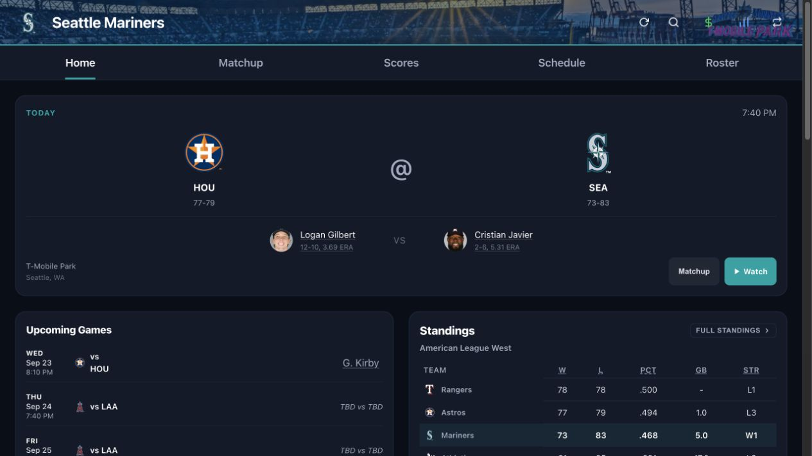
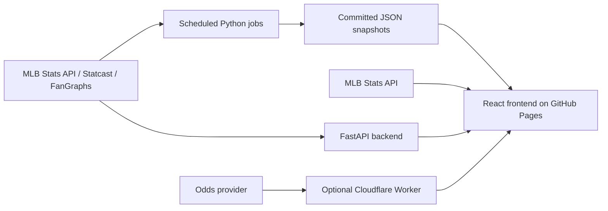

# Baseball App

A mobile-first MLB dashboard that brings team context, live game data, player analytics, and experimental fantasy projections into one interface. The project combines a React frontend, a Python/FastAPI backend, scheduled data pipelines, and a 3D ball-flight viewer.

**[Open the demo](https://statsleuthgame.github.io/baseball-app/)** · **[Model evaluation and limitations](docs/MODEL_EVALUATION.md)**



*Public demo captured September 22, 2026. Data and schedules change over time.*

## Try it

Choose a team, open its dashboard, then explore **Matchup**, **Scores**, **Schedule**, or **Roster**. The dashboard combines the next game, recent player form, transactions, and standings. Live game views depend on the MLB schedule and upstream data availability.

## What the project demonstrates

- **Data integration:** MLB Stats API, Statcast features, and FanGraphs projections feed a shared application experience.
- **Interactive visualization:** strike-zone and spray-chart views, plus a React Three Fiber ball-flight scene with trajectory calculations, fielders, runners, and camera controls.
- **Delivery automation:** GitHub Actions publish the frontend and refresh committed data snapshots on a schedule.
- **Experimental modeling:** a configurable fantasy-point projection function, unit tests, and a historical backtesting/calibration workflow. Predictive performance remains subject to the evaluation qualifications below.

## Engineering decisions

| Constraint | Implementation | Tradeoff |
| --- | --- | --- |
| Many views need data before a backend request completes | Pre-generated JSON for supported views, with direct MLB API calls and fallback paths in [the API client](frontend/src/api/client.js) | Snapshots can be stale; data availability and freshness differ by view. |
| Live games change more often than rosters and standings | View-specific TanStack Query refresh intervals | Polling trades request volume for freshness; this is not a streaming feed. |
| Projection logic needs to be inspectable | [The fantasy model](backend/app/services/fantasy.py) separates projection math from slate orchestration and exposes configurable weights | A transparent formula still needs independent predictive validation. |
| An odds-provider key must stay out of the frontend bundle | Optional [Cloudflare Worker](cloudflare/odds-proxy) | Requires a separately configured service; the core team dashboard can run without it. |

## Architecture



**Frontend:** React 19, Vite, React Router, TanStack Query, Three.js / React Three Fiber, D3.
**Backend and data:** Python, FastAPI, httpx, pybaseball, pandas, Pydantic.
**Delivery:** GitHub Pages, GitHub Actions, Render configuration, optional Cloudflare Worker.

The public repository includes the app and its fantasy model. A separate, optional Edge integration reads externally generated picks; it is not required for the team dashboard and its model implementation is not included here.

## Model evaluation

The fantasy model estimates hitter fantasy points using historical event rates, recent form, and contextual adjustments. It is a statistical projection system, not an LLM feature.

The current backtest conditions on **actual plate appearances**, and its fitter divides CSV rows into an 80/20 split without enforcing a date boundary. Stored calibration metrics therefore should not be presented as verified pregame accuracy or evidence of profitable recommendations.

The [evaluation notes](docs/MODEL_EVALUATION.md) explain the existing evidence, reproducibility gaps, and the requirements for an independent chronological evaluation. UI labels such as “edge” represent model estimates, not proven positive expected value.

## Run locally

Use Node **22.12+** or a compatible newer LTS for the Vite 8 frontend, and Python **3.11+** for the backend. Commands below run from the repository root unless noted.

### Frontend

```bash
cd frontend
npm ci
npm run dev
```

Open `http://localhost:5173/baseball-app/`. Many views use committed JSON or the public MLB API. Backend-powered routes require the API below.

### Backend (separate terminal)

```bash
python3 -m venv .venv
source .venv/bin/activate
python -m pip install -r backend/requirements.txt
python -m uvicorn app.main:app --reload --app-dir backend --port 10000
```

The Vite dev server proxies `/api` to port 10000. Optional live odds require `VITE_ODDS_PROXY_URL` at frontend build time and a configured Worker; keep the provider secret on the Worker.

### Checks

```bash
# From the repository root, with the Python environment active
python -m pip install pytest
PYTHONPATH=backend python -m pytest backend/tests/test_fantasy.py -q

# Frontend compilation
cd frontend
npm run build
```

**Verification snapshot, September 22, 2026:** 66 model tests passed and 3 were skipped under the checked-in configuration. Unit tests check implementation behavior; they do not establish predictive accuracy. See [model evaluation](docs/MODEL_EVALUATION.md) before running calibration, which can overwrite the model's weight file.

## Source map

- [`frontend/src/api/client.js`](frontend/src/api/client.js) — static and live data access.
- [`frontend/src/components/ballflight3d/`](frontend/src/components/ballflight3d/) — visualization engine.
- [`backend/app/services/fantasy.py`](backend/app/services/fantasy.py) — projection math and slate orchestration.
- [`scripts/backtest_fantasy.py`](scripts/backtest_fantasy.py) — historical dataset generation and calibration.
- [`.github/workflows/`](.github/workflows/) — deployment and data-refresh jobs.
- [`docs/ACCESSIBILITY_AUDIT.md`](docs/ACCESSIBILITY_AUDIT.md) — existing accessibility review.

## Project context

A personal project by Cody Ostler, developed with AI coding assistance.

Not affiliated with MLB or the data providers. Projection features are educational modeling experiments, not betting advice.
